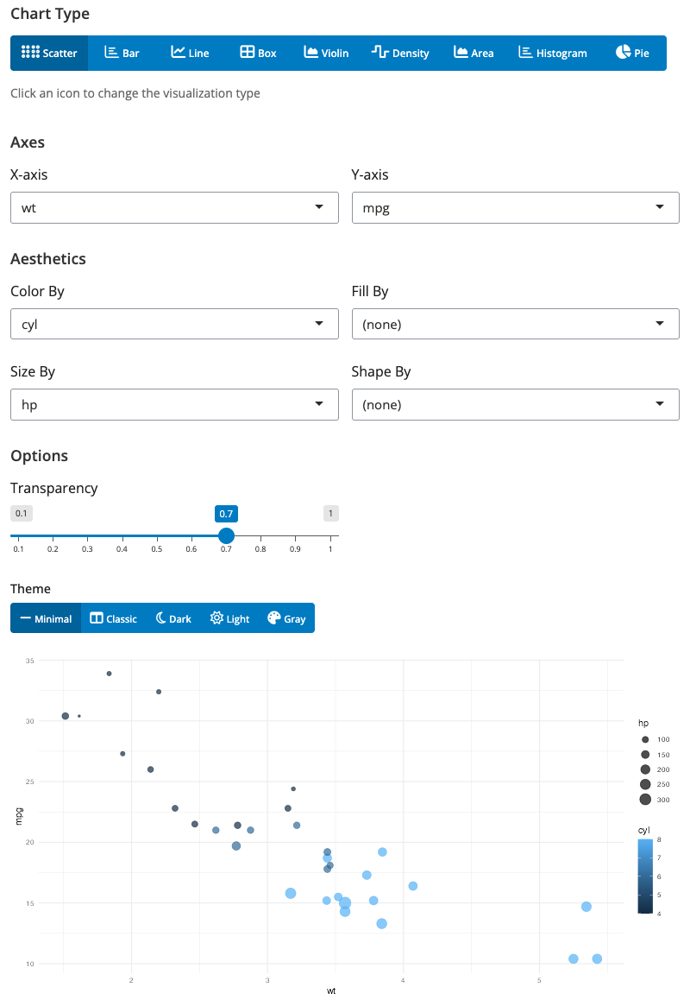
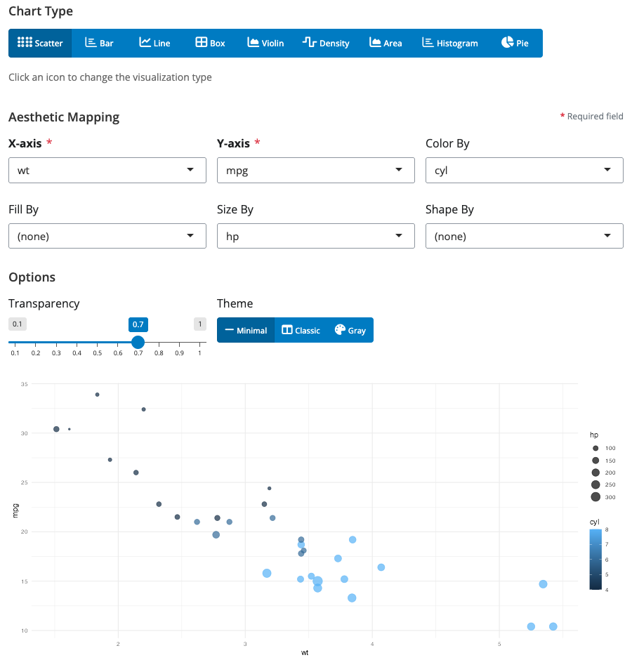
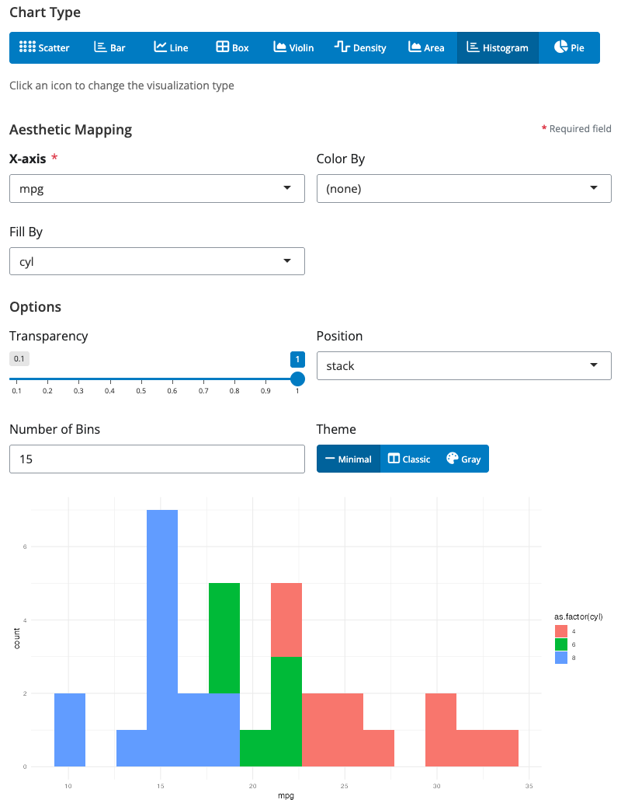
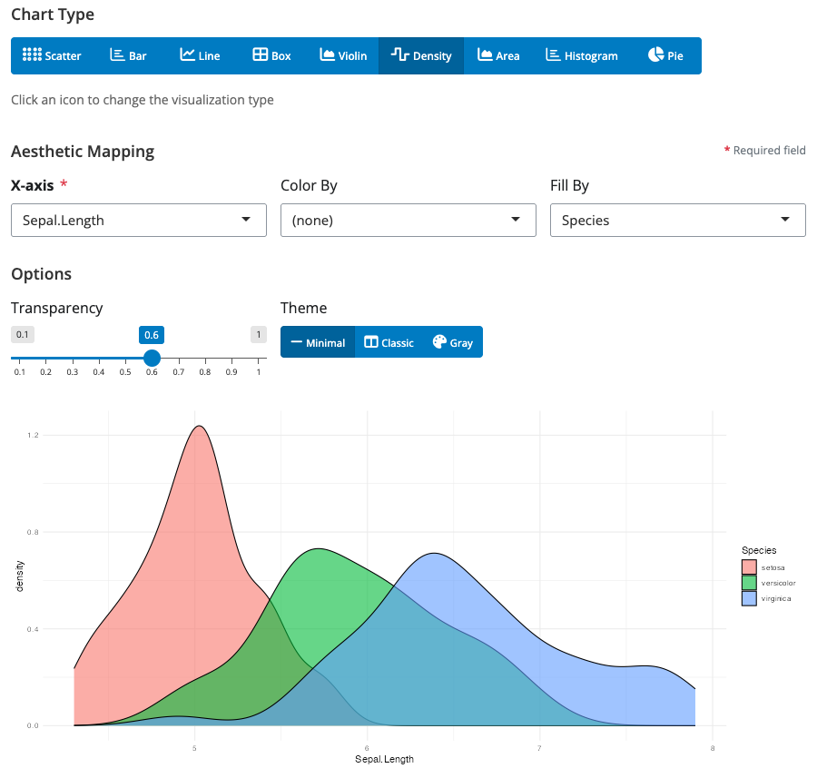
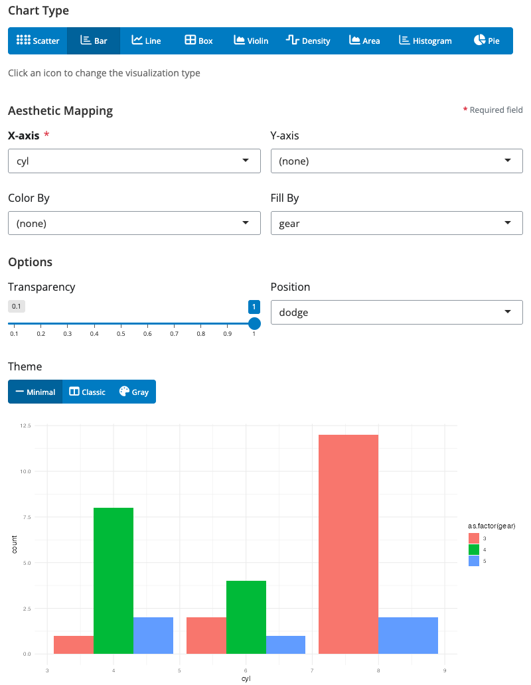
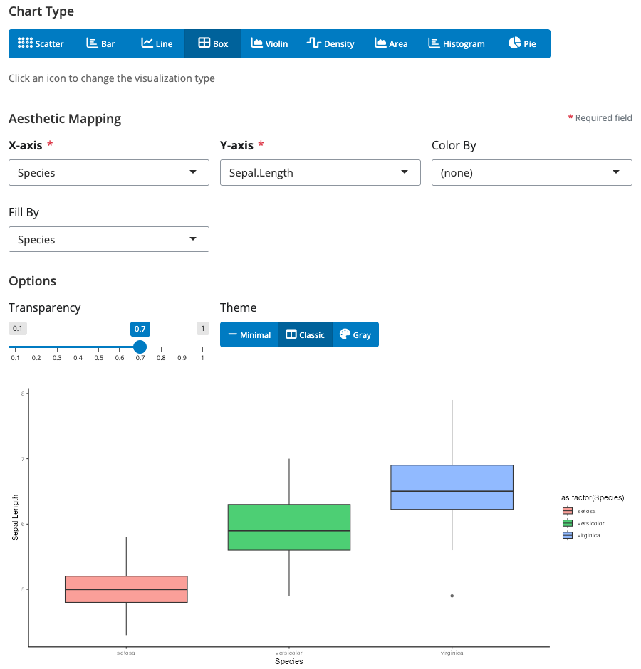
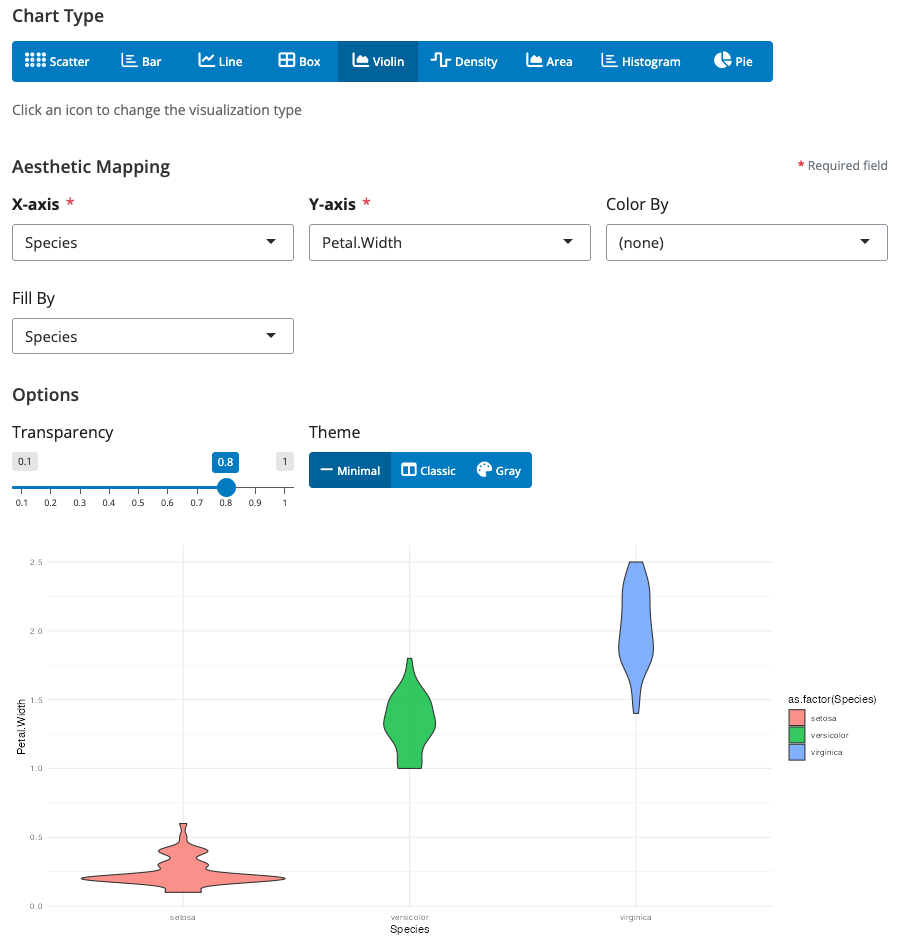
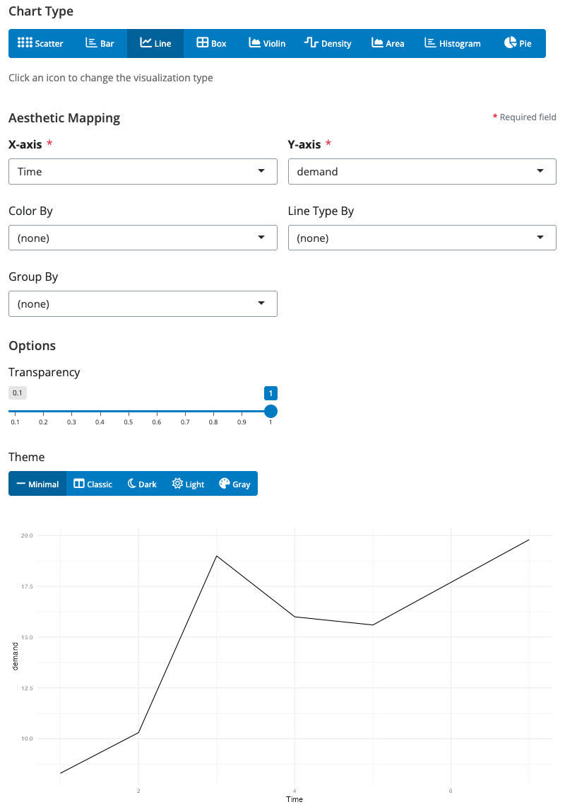
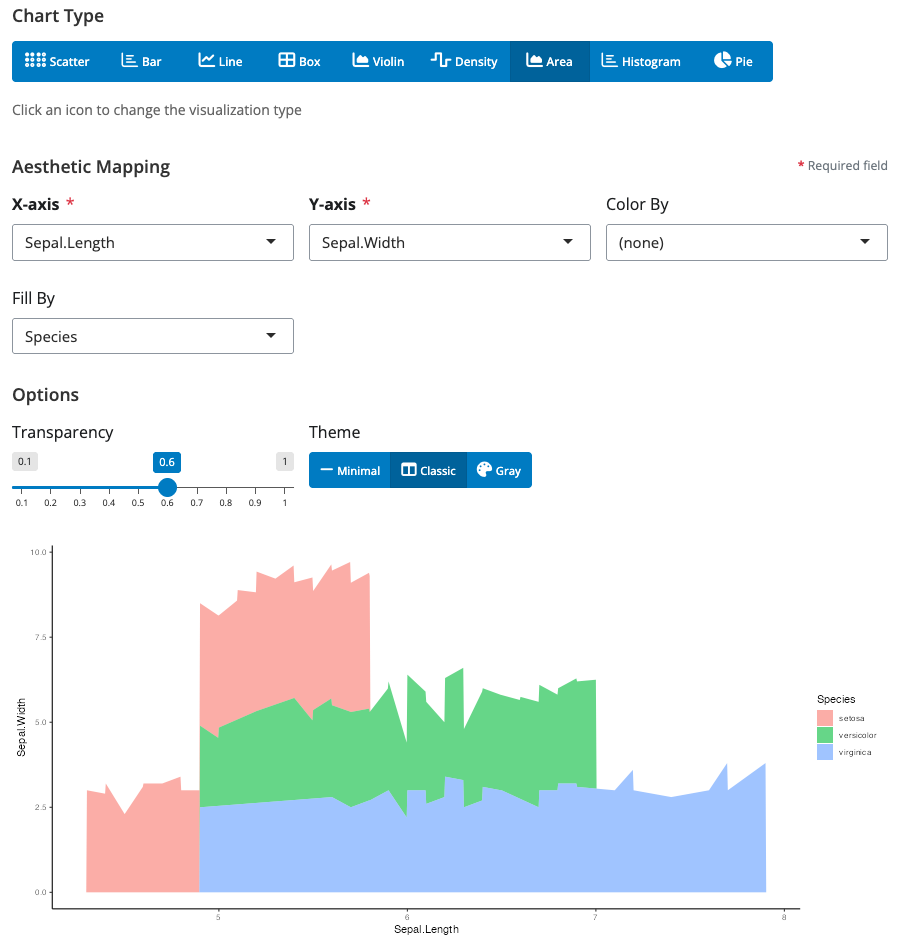
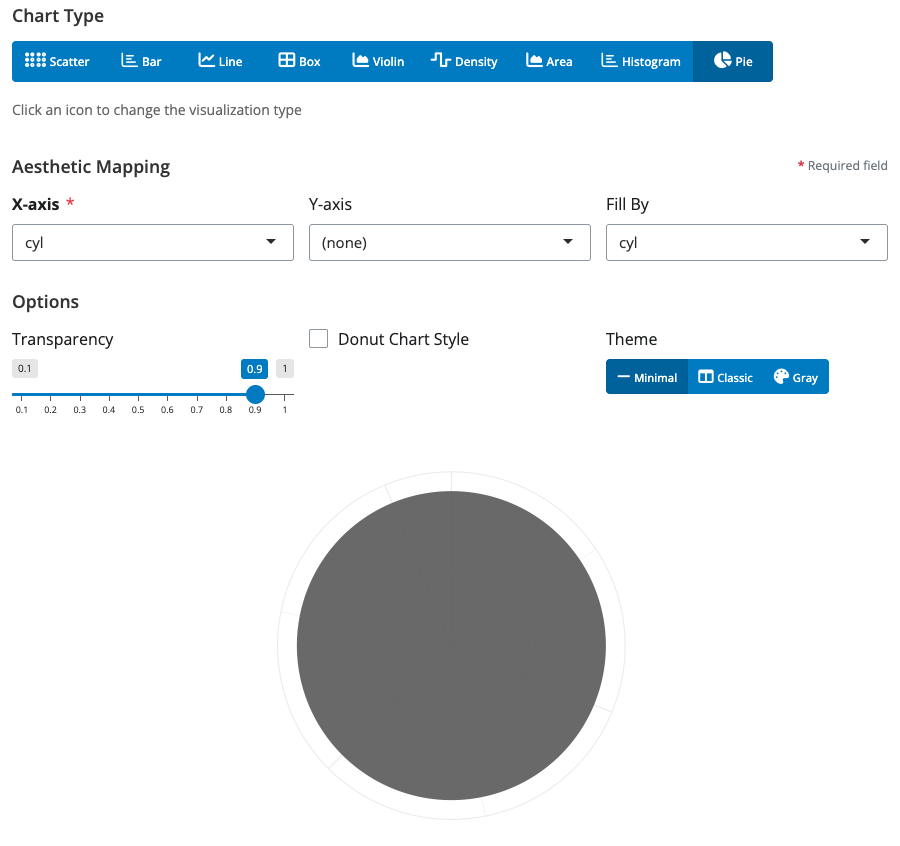

# blockr.ggplot

<!-- badges: start -->
[](https://github.com/BristolMyersSquibb/blockr.ggplot/actions/workflows/ci.yaml)
<!-- badges: end -->

**One Block, All Chart Types - Universal Data Visualization for blockr.core**

`blockr.ggplot` extends [blockr.core](https://github.com/BristolMyersSquibb/blockr.core) with a single, powerful universal ggplot block that provides all major visualization types through an intuitive interface. Simply select your chart type and watch the interface dynamically adapt to show relevant controls. Build visualization pipelines by connecting data transformation blocks to this flexible plotting block in an interactive drag-and-drop interface.

## Installation

Install the development version from GitHub:

```r
# install.packages("devtools")
devtools::install_github("BristolMyersSquibb/blockr.ggplot")
```

## Quick Start

```r
library(blockr.ggplot)

# Create and serve the universal ggplot block
blockr.core::serve(
  new_ggplot_block(type = "point", x = "wt", y = "mpg", color = "cyl"),
  data = list(data = mtcars)
)
```

This launches an interactive web interface where you can:
- **Switch chart types instantly** - Change from scatter to bar, line, boxplot, and more with a single dropdown
- **Dynamic controls** - UI automatically adapts to show only relevant options for your selected chart type
- **Real-time preview** - See your visualization update as you modify settings
- **Rich customization** - Fine-tune aesthetics, themes, and styling options

## The Universal ggplot Block

`blockr.ggplot` provides a single, powerful block that handles all your visualization needs. No need to learn multiple blocks - just one interface that adapts to your chosen chart type.



### Key Features

- **🔄 One Block, Many Charts**: Switch between 9+ chart types with a single dropdown
- **🎯 Smart Interface**: Controls dynamically show/hide based on your selected chart type
- **🎨 Rich Aesthetics**: Map data to colors, shapes, sizes, fills, and more
- **⚡ Real-time Updates**: See changes instantly as you adjust settings
- **🎭 Multiple Themes**: Choose from minimal, classic, dark, light, and gray themes

### Available Chart Types

Simply change the `type` parameter to create different visualizations:

```r
# Scatter plot
blockr.core::serve(
  new_ggplot_block(type = "point", x = "wt", y = "mpg", color = "cyl"),
  data = list(data = mtcars)
)

# Bar chart
blockr.core::serve(
  new_ggplot_block(type = "bar", x = "cyl", fill = "gear"),
  data = list(data = mtcars)
)

# Line chart
blockr.core::serve(
  new_ggplot_block(type = "line", x = "wt", y = "mpg", color = "cyl"),
  data = list(data = mtcars)
)

# Box plot
blockr.core::serve(
  new_ggplot_block(type = "boxplot", x = "cyl", y = "mpg"),
  data = list(data = mtcars)
)

# And many more: violin, density, area, histogram, pie...
```

## Chart Types Gallery

All visualizations below are created with the same `ggplot_block` - just by changing the `type` parameter. Each screenshot shows the universal block configured for that specific chart type.

### Distribution Visualizations

#### Scatter Plot (`type = "point"`)

*Perfect for exploring relationships between continuous variables*

#### Histogram (`type = "histogram"`)

*Visualize the distribution of a single continuous variable*

#### Density Plot (`type = "density"`)

*Smooth probability density curves for distribution analysis*

### Categorical Comparisons

#### Bar Chart (`type = "bar"`)

*Compare values across categories with optional grouping and stacking*

#### Box Plot (`type = "boxplot"`)

*Show distribution statistics across different groups*

#### Violin Plot (`type = "violin"`)

*Combine box plot statistics with density distribution shapes*

### Time Series & Trends

#### Line Chart (`type = "line"`)

*Track changes over time or continuous sequences*

#### Area Chart (`type = "area"`)

*Emphasize cumulative totals and magnitude of change*

### Proportions

#### Pie Chart (`type = "pie"`)

*Show parts of a whole (set `donut = TRUE` for donut charts)*


## Example: Interactive Pipeline with DAG Board

The universal ggplot block integrates seamlessly with blockr's pipeline system:

```r
library(blockr.core)
library(blockr.ggplot)
library(blockr.ui)

# Create a visualization pipeline with the universal ggplot block
board <- blockr.ui::new_dag_board(
  blocks = c(
    data_block = new_dataset_block("iris", package = "datasets"),
    chart = new_ggplot_block(
      type = "point",  # Start with scatter plot
      x = "Sepal.Length",
      y = "Petal.Length",
      color = "Species"
    )
  ),
  links = c(
    chart_link = new_link("data_block", "chart", "data")
  )
)

blockr.core::serve(board)
```

This creates an interactive dashboard where you can:
- **Switch visualizations on-the-fly**: Change chart type without breaking the pipeline
- **Modify data sources**: Swap datasets or add transformation blocks
- **Build complex workflows**: Chain multiple data operations before visualization

## More Examples

### Combining Multiple Plots with Plot Grid

Create a dashboard that combines multiple charts using `new_plot_grid_block()`. The grid block uses [patchwork](https://patchwork.data-imaginist.com/) for modern, automatically-aligned plot composition:

```r
library(blockr.core)
library(blockr.ggplot)
library(blockr.ui)

# Create a dashboard with two charts combined in a grid
board <- blockr.ui::new_dag_board(
  blocks = c(
    data = new_dataset_block("mtcars", package = "datasets"),
    scatter = new_ggplot_block(type = "point", x = "wt", y = "mpg", color = "cyl"),
    boxplot = new_ggplot_block(type = "boxplot", x = "cyl", y = "mpg", fill = "cyl"),
    grid = new_plot_grid_block()
  ),
  links = c(
    new_link("data", "scatter", "data"),
    new_link("data", "boxplot", "data"),
    new_link("scatter", "grid", "1"),
    new_link("boxplot", "grid", "2")
  )
)

blockr.core::serve(board)
```

This creates a single combined visualization with:
- A scatter plot showing weight vs. mpg
- A boxplot showing mpg distribution by cylinder count
- Both plots automatically aligned and arranged using patchwork
- Supports any number of plots (not just two!)

### Exploring Different Chart Types with Same Data

```r
# Try different visualizations of the same dataset
library(blockr.ggplot)

# Distribution of a single variable
blockr.core::serve(
  new_ggplot_block(type = "histogram", x = "mpg", bins = 20),
  data = list(data = mtcars)
)

# Relationship between variables
blockr.core::serve(
  new_ggplot_block(type = "point", x = "hp", y = "mpg", color = "cyl", size = "wt"),
  data = list(data = mtcars)
)

# Group comparisons
blockr.core::serve(
  new_ggplot_block(type = "violin", x = "cyl", y = "mpg", fill = "cyl"),
  data = list(data = mtcars)
)

# Proportions
blockr.core::serve(
  new_ggplot_block(type = "pie", x = "cyl", donut = TRUE),
  data = list(data = mtcars)
)
```

## Learn More

- [blockr.core documentation](https://github.com/BristolMyersSquibb/blockr.core)
- [blockr.ui documentation](https://github.com/BristolMyersSquibb/blockr.ui)
- [blockr.dplyr documentation](https://github.com/BristolMyersSquibb/blockr.dplyr)
- [ggplot2 documentation](https://ggplot2.tidyverse.org/)