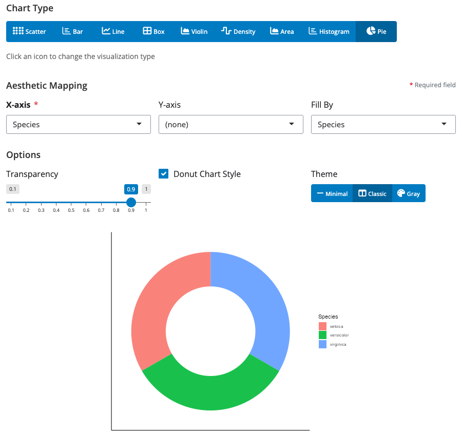

# blockr.ggplot

<!-- badges: start -->
[](https://github.com/BristolMyersSquibb/blockr.ggplot/actions/workflows/ci.yaml)
<!-- badges: end -->

**Data visualization blocks for blockr.core**

`blockr.ggplot` extends [blockr.core](https://github.com/BristolMyersSquibb/blockr.core) with comprehensive plotting blocks for data visualization, providing intuitive visual interfaces for creating professional charts and graphs. Build visualization pipelines by connecting data transformation blocks to powerful plotting blocks in an interactive drag-and-drop interface.

## Installation

Install the development version from GitHub:

```r
# install.packages("devtools")
devtools::install_github("BristolMyersSquibb/blockr.ggplot")
```

## Quick Start

```r
library(blockr.ggplot)

# Create and serve a simple scatter plot
blockr.core::serve(
  new_scatter_plot_block(x = "wt", y = "mpg", color = "cyl"),
  data = list(data = mtcars)
)
```

This launches an interactive web interface where you can:
- Configure plot aesthetics with visual controls
- See real-time preview as you modify settings
- Customize titles, colors, and styling options

## Universal Chart Block - All Chart Types in One

The new `chart_block` provides a single interface for all visualization types with dynamic aesthetic controls.


**Features:**
- **Dynamic chart type selection**: Switch between scatter, bar, line, boxplot, violin, density, area, and histogram
- **Smart aesthetic controls**: UI automatically shows/hides relevant aesthetics based on selected chart type
- **Unified interface**: Explore different visualizations without switching blocks

**Simple usage:**
```r
library(blockr.ggplot)
blockr.core::serve(
  new_chart_block(
    type = "point",  # Can be: point, bar, line, boxplot, violin, density, area, histogram
    x = "wt",
    y = "mpg", 
    color = "cyl"
  ),
  data = list(data = mtcars)
)
```

## Chart Types Gallery

The universal `chart_block` supports all major visualization types. Simply change the `type` parameter to switch between different charts:

### Bar Charts


### Histograms  


### Line Charts


### Pie & Donut Charts



### Density Plots


**Available chart types:**
- `"point"` - Scatter plots with multiple aesthetic mappings
- `"bar"` - Bar/column charts with grouping and stacking
- `"line"` - Line charts for time series and trends
- `"boxplot"` - Box plots for distribution analysis
- `"violin"` - Violin plots for distribution shapes
- `"density"` - Density plots for smooth distributions
- `"area"` - Area charts for cumulative visualization
- `"histogram"` - Histograms for frequency distributions
- `"pie"` - Pie and donut charts for proportions


## DAG Board Example

Connect data transformation and visualization blocks in an interactive pipeline:

```r
library(blockr.core)
library(blockr.ggplot)
library(blockr.ui)

# Create a simple visualization pipeline
board <- blockr.ui::new_dag_board(
  blocks = c(
    data_block = new_dataset_block("iris", package = "datasets"),
    scatter_plot = new_scatter_plot_block(
      x = "Sepal.Length",
      y = "Petal.Length", 
      color = "Species",
      add_smooth = TRUE
    )
  ),
  links = c(
    chart_link = new_link("data_block", "scatter_plot", "data")
  )
)

blockr.core::serve(board)
```

This creates an interactive dashboard where you can:
- **Modify data**: Change datasets or add filters
- **Adjust plots**: Update aesthetics and styling in real-time
- **Chain blocks**: Connect multiple transformation and visualization blocks

## Learn More

- [blockr.core documentation](https://github.com/BristolMyersSquibb/blockr.core)
- [blockr.ui documentation](https://github.com/BristolMyersSquibb/blockr.ui)
- [blockr.dplyr documentation](https://github.com/BristolMyersSquibb/blockr.dplyr)
- [ggplot2 documentation](https://ggplot2.tidyverse.org/)