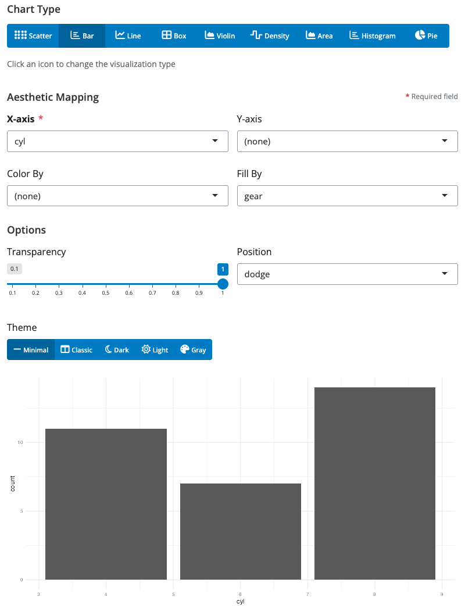
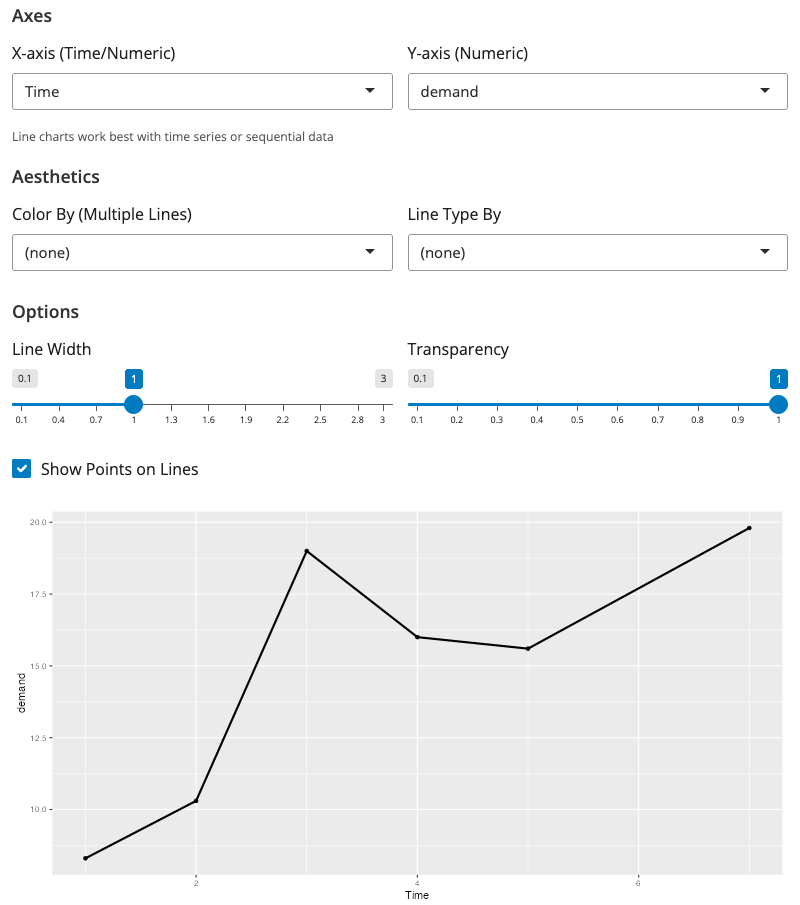
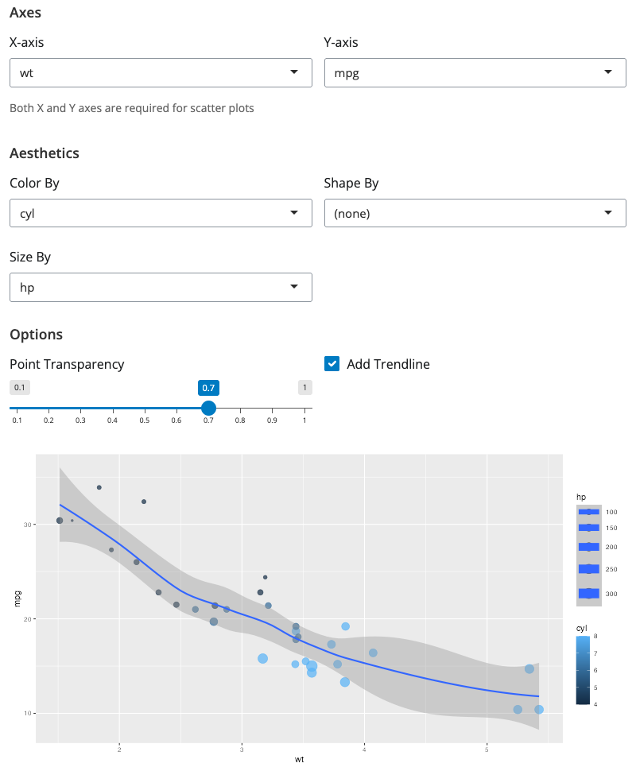
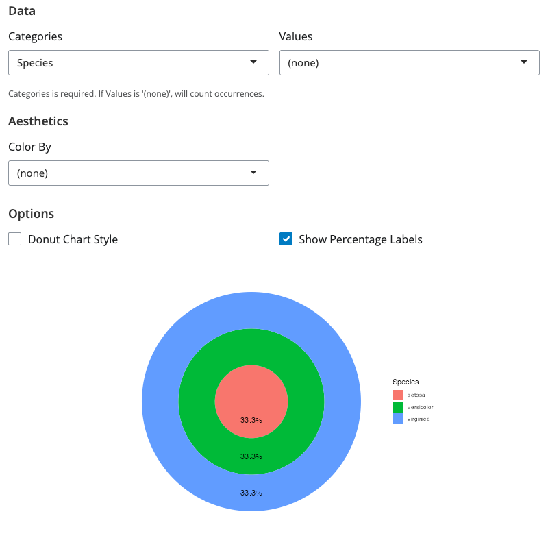
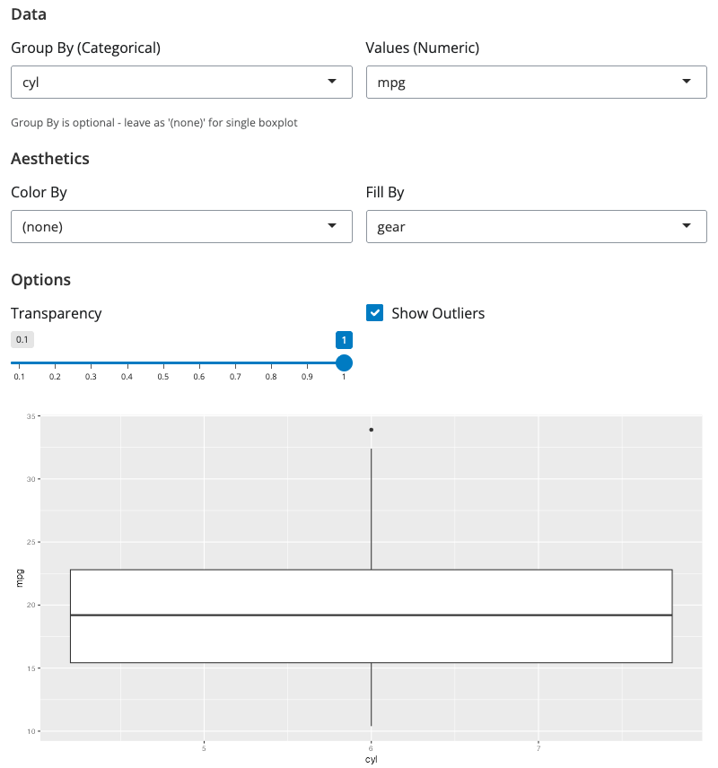
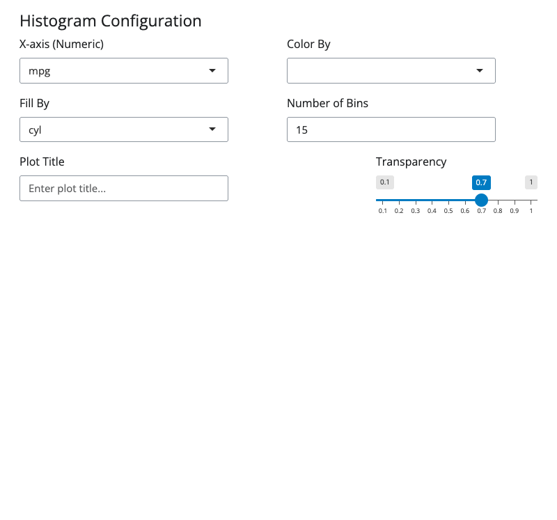
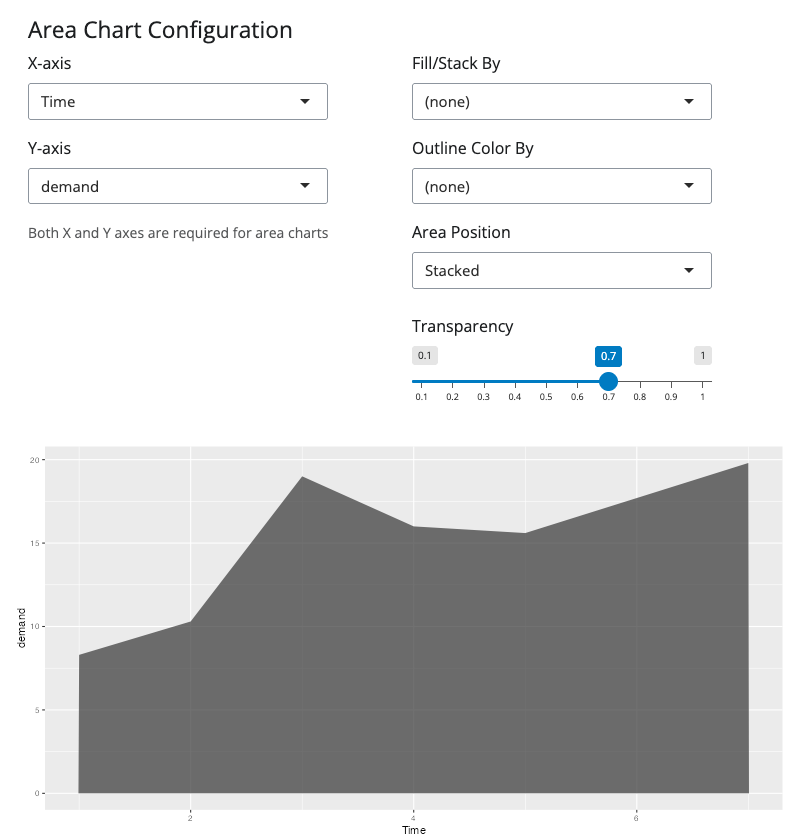
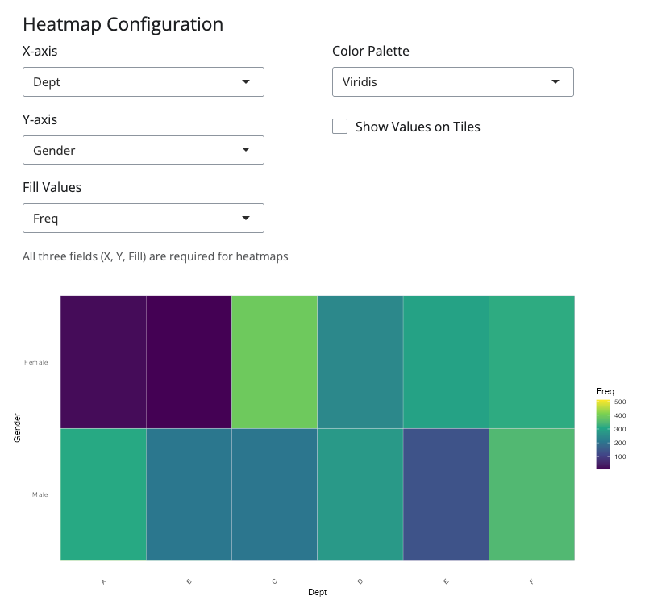
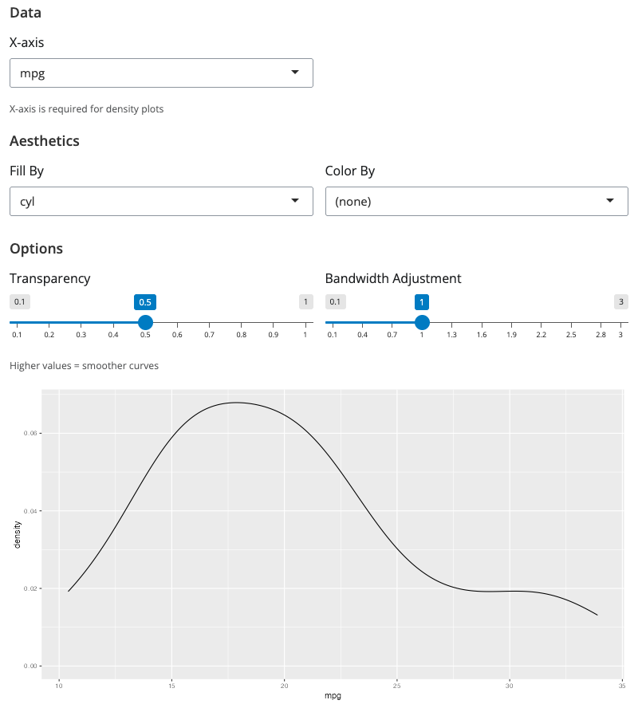
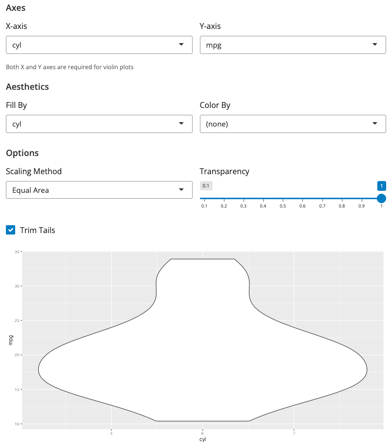

# blockr.ggplot

<!-- badges: start -->
[](https://github.com/BristolMyersSquibb/blockr.ggplot/actions/workflows/ci.yaml)
<!-- badges: end -->

**Data visualization blocks for blockr.core**

`blockr.ggplot` extends [blockr.core](https://github.com/BristolMyersSquibb/blockr.core) with comprehensive plotting blocks for data visualization, providing intuitive visual interfaces for creating professional charts and graphs. Build visualization pipelines by connecting data transformation blocks to powerful plotting blocks in an interactive drag-and-drop interface.

## Installation

Install the development version from GitHub:

```r
# install.packages("devtools")
devtools::install_github("BristolMyersSquibb/blockr.ggplot")
```

## Quick Start

```r
library(blockr.ggplot)

# Create and serve a simple scatter plot
blockr.core::serve(
  new_scatter_plot_block(x = "wt", y = "mpg", color = "cyl"),
  data = list(data = mtcars)
)
```

This launches an interactive web interface where you can:
- Configure plot aesthetics with visual controls
- See real-time preview as you modify settings
- Customize titles, colors, and styling options

## Universal Chart Block - All Chart Types in One

The new `chart_block` provides a single interface for all visualization types with dynamic aesthetic controls.


**Features:**
- **Dynamic chart type selection**: Switch between scatter, bar, line, boxplot, violin, density, area, and histogram
- **Smart aesthetic controls**: UI automatically shows/hides relevant aesthetics based on selected chart type
- **Unified interface**: Explore different visualizations without switching blocks

**Simple usage:**
```r
library(blockr.ggplot)
blockr.core::serve(
  new_chart_block(
    type = "point",  # Can be: point, bar, line, boxplot, violin, density, area, histogram
    x = "wt",
    y = "mpg", 
    color = "cyl"
  ),
  data = list(data = mtcars)
)
```

## Individual Blocks

### Bar Chart Block - Column/Bar Charts

Create bar charts with support for grouping, stacking, and horizontal orientation.



**Simple usage:**
```r
library(blockr.ggplot)
blockr.core::serve(
  new_bar_chart_block(x = "cyl", fill = "gear", position = "dodge"),
  data = list(data = mtcars)
)
```


### Line Chart Block - Time Series & Trends

Perfect for time series data and trend visualization with multiple line support.



**Simple usage:**
```r
library(blockr.ggplot)
blockr.core::serve(
  new_line_chart_block(x = "Time", y = "demand"),
  data = list(data = BOD)
)
```


### Scatter Plot Block - XY Relationships

Explore relationships between variables with full aesthetic mapping support.



**Simple usage:**
```r
library(blockr.ggplot)
blockr.core::serve(
  new_scatter_plot_block(
    x = "wt",
    y = "mpg",
    color = "cyl",
    size = "hp",
    add_smooth = TRUE
  ),
  data = list(data = mtcars)
)
```


### Pie Chart Block - Categorical Proportions

Visualize categorical data proportions with standard and donut chart styles.



**Simple usage:**
```r
library(blockr.ggplot)
blockr.core::serve(
  new_pie_chart_block(
    x = "Species",
    y = "Sepal.Length",
    show_labels = TRUE
  ),
  data = list(data = iris)
)
```


### Boxplot Block - Distribution Analysis

Enhanced boxplot visualization for exploring data distributions and outliers.



**Simple usage:**
```r
library(blockr.ggplot)
blockr.core::serve(
  new_boxplot_block(
    x = "cyl",
    y = "mpg",
    fill = "gear",
    show_outliers = TRUE
  ),
  data = list(data = mtcars)
)
```


### Histogram Block - Frequency Distributions

Visualize data distributions with customizable binning and styling.



**Simple usage:**
```r
library(blockr.ggplot)
blockr.core::serve(
  new_histogram_block(
    x = "mpg",
    bins = 15,
    fill = "cyl",
    alpha = 0.7
  ),
  data = list(data = mtcars)
)
```


### Area Chart Block - Cumulative Visualization

Show cumulative values over time with stacking support.



**Simple usage:**
```r
library(blockr.ggplot)
blockr.core::serve(
  new_area_chart_block(
    x = "Time",
    y = "demand",
    title = "BOD Demand Over Time"
  ),
  data = list(data = BOD)
)
```


### Heatmap Block - 2D Data Visualization

Visualize 2D categorical data or correlation matrices with color intensity.



**Simple usage:**
```r
library(blockr.ggplot)

# Use admissions contingency table from datasets and convert to data.frame
ucb <- as.data.frame(UCBAdmissions)

blockr.core::serve(
  new_heatmap_block(
    x = "Dept",
    y = "Gender",
    fill = "Freq",
    color_palette = "viridis",
    show_values = TRUE
  ),
  data = list(data = ucb)
)
```


### Density Plot Block - Smooth Distributions

Create smooth density curves for continuous variable distributions.



**Simple usage:**
```r
library(blockr.ggplot)
blockr.core::serve(
  new_density_plot_block(
    x = "mpg",
    fill = "cyl",
    alpha = 0.6,
    adjust = 1.2
  ),
  data = list(data = mtcars)
)
```


### Violin Plot Block - Distribution Shapes

Show detailed distribution shapes combining density and boxplot concepts.



**Simple usage:**
```r
library(blockr.ggplot)
blockr.core::serve(
  new_violin_plot_block(
    x = "cyl",
    y = "mpg",
    fill = "cyl",
    scale = "area"
  ),
  data = list(data = mtcars)
)
```


## DAG Board Example

Connect data transformation and visualization blocks in an interactive pipeline:

```r
library(blockr.core)
library(blockr.ggplot)
library(blockr.ui)

# Create a simple visualization pipeline
board <- blockr.ui::new_dag_board(
  blocks = c(
    data_block = new_dataset_block("iris", package = "datasets"),
    scatter_plot = new_scatter_plot_block(
      x = "Sepal.Length",
      y = "Petal.Length", 
      color = "Species",
      add_smooth = TRUE
    )
  ),
  links = c(
    chart_link = new_link("data_block", "scatter_plot", "data")
  )
)

blockr.core::serve(board)
```

This creates an interactive dashboard where you can:
- **Modify data**: Change datasets or add filters
- **Adjust plots**: Update aesthetics and styling in real-time
- **Chain blocks**: Connect multiple transformation and visualization blocks

## Learn More

- [blockr.core documentation](https://github.com/BristolMyersSquibb/blockr.core)
- [blockr.ui documentation](https://github.com/BristolMyersSquibb/blockr.ui)
- [blockr.dplyr documentation](https://github.com/BristolMyersSquibb/blockr.dplyr)
- [ggplot2 documentation](https://ggplot2.tidyverse.org/)