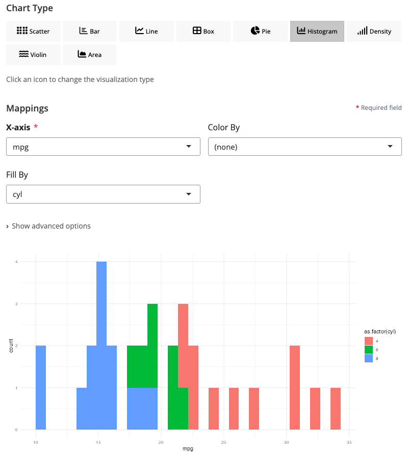

# blockr.ggplot

<!-- badges: start -->
[](https://github.com/BristolMyersSquibb/blockr.ggplot/actions/workflows/ci.yaml)
<!-- badges: end -->

**One Block, All Chart Types - Universal Data Visualization for blockr.core**

`blockr.ggplot` extends [blockr.core](https://github.com/BristolMyersSquibb/blockr.core) with a single, powerful universal ggplot block that provides all major visualization types through an intuitive interface. Simply select your chart type and watch the interface dynamically adapt to show relevant controls. Build visualization pipelines by connecting data transformation blocks to this flexible plotting block in an interactive drag-and-drop interface.

## Installation

Install the development version from GitHub:

```r
# install.packages("devtools")
pak::pak("BristolMyersSquibb/blockr.ggplot")
```

## Quick Start

```r
library(blockr.ggplot)

# Create and serve the universal ggplot block
blockr.core::serve(
  new_ggplot_block(type = "point", x = "wt", y = "mpg", color = "cyl"),
  data = list(data = mtcars)
)
```

This launches an interactive web interface where you can:
- **Switch chart types instantly** - Change from scatter to bar, line, boxplot, and more with a single dropdown
- **Dynamic controls** - UI automatically adapts to show only relevant options for your selected chart type
- **Real-time preview** - See your visualization update as you modify settings
- **Rich customization** - Fine-tune aesthetics, themes, and styling options

## The Universal ggplot Block

`blockr.ggplot` provides a single, powerful block that handles all your visualization needs. No need to learn multiple blocks - just one interface that adapts to your chosen chart type.


### Key Features

- **🔄 One Block, Many Charts**: Switch between 9+ chart types with a single dropdown
- **🎯 Smart Interface**: Controls dynamically show/hide based on your selected chart type
- **🎨 Rich Aesthetics**: Map data to colors, shapes, sizes, fills, and more
- **⚡ Real-time Updates**: See changes instantly as you adjust settings
- **🎭 Multiple Themes**: Choose from minimal, classic, dark, light, and gray themes

### Available Chart Types

Simply change the `type` parameter to create different visualizations:

```r
# Scatter plot
blockr.core::serve(
  new_ggplot_block(type = "point", x = "wt", y = "mpg", color = "cyl"),
  data = list(data = mtcars)
)

# Bar chart
blockr.core::serve(
  new_ggplot_block(type = "bar", x = "cyl", fill = "gear"),
  data = list(data = mtcars)
)

# Line chart
blockr.core::serve(
  new_ggplot_block(type = "line", x = "wt", y = "mpg", color = "cyl"),
  data = list(data = mtcars)
)

# Box plot
blockr.core::serve(
  new_ggplot_block(type = "boxplot", x = "cyl", y = "mpg"),
  data = list(data = mtcars)
)

# And many more: violin, density, area, histogram, pie...
```

## Chart Types Gallery

All visualizations below are created with the same `ggplot_block` - just by changing the `type` parameter. Each screenshot shows the universal block configured for that specific chart type.

### Distribution Visualizations

#### Scatter Plot (`type = "point"`)

*Perfect for exploring relationships between continuous variables*

#### Histogram (`type = "histogram"`)

*Visualize the distribution of a single continuous variable*

#### Density Plot (`type = "density"`)

*Smooth probability density curves for distribution analysis*

### Categorical Comparisons

#### Bar Chart (`type = "bar"`)

*Compare values across categories with optional grouping and stacking*

#### Box Plot (`type = "boxplot"`)

*Show distribution statistics across different groups*

#### Violin Plot (`type = "violin"`)

*Combine box plot statistics with density distribution shapes*

### Time Series & Trends

#### Line Chart (`type = "line"`)

*Track changes over time or continuous sequences*

#### Area Chart (`type = "area"`)

*Emphasize cumulative totals and magnitude of change*

### Proportions

#### Pie Chart (`type = "pie"`)

*Show parts of a whole (set `donut = TRUE` for donut charts)*

## Advanced Composition Blocks

Beyond the universal ggplot block, `blockr.ggplot` provides specialized blocks for advanced plot composition and styling:

### Facet Block - Small Multiples


Split your visualization into multiple panels to compare patterns across categories. The facet block supports both `facet_wrap()` (flexible grid layout) and `facet_grid()` (rows × columns matrix).

```r
# Example: Split scatter plot by cylinder count
board <- new_board(
  blocks = c(
    data = new_dataset_block("mtcars", package = "datasets"),
    scatter = new_ggplot_block(
      type = "point",
      x = "wt",
      y = "mpg",
      color = "cyl"
    ),
    facet = new_facet_block(
      facet_type = "wrap",
      facets = "cyl",
      ncol = "2",
      scales = "free_y"  # Independent Y-axis per panel
    )
  ),
  links = c(
    new_link("data", "scatter", "data"),
    new_link("scatter", "facet", "data")
  )
)

blockr.core::serve(board)
```

**Key Features:**
- 📊 **Two Modes**: facet_wrap (auto-layout) or facet_grid (explicit rows/columns)
- 📐 **Visual Preview**: See facet layout before rendering
- 🎯 **Flexible Scales**: Free, fixed, or partially free axes
- 🏷️ **Custom Labels**: Multiple labeller functions for panel titles

### Grid Block - Multi-Plot Dashboards


Combine multiple independent plots into a unified dashboard using the powerful [patchwork](https://patchwork.data-imaginist.com/) package. Plots are automatically aligned and arranged for publication-quality output.

```r
# Example: Combine three different chart types
board <- new_board(
  blocks = c(
    data = new_dataset_block("mtcars", package = "datasets"),
    scatter = new_ggplot_block(type = "point", x = "wt", y = "mpg", color = "cyl"),
    boxplot = new_ggplot_block(type = "boxplot", x = "cyl", y = "mpg", fill = "cyl"),
    histogram = new_ggplot_block(type = "histogram", x = "mpg", bins = 15),
    grid = new_grid_block()
  ),
  links = c(
    new_link("data", "scatter", "data"),
    new_link("data", "boxplot", "data"),
    new_link("data", "histogram", "data"),
    new_link("scatter", "grid", "1"),
    new_link("boxplot", "grid", "2"),
    new_link("histogram", "grid", "3")
  )
)

blockr.core::serve(board)
```

**Key Features:**
- 🎨 **Automatic Layout**: Intelligent plot arrangement using patchwork
- 🔗 **Any Number of Plots**: Combine 2, 3, 4+ plots seamlessly
- 📏 **Perfect Alignment**: Axes, legends, and spacing automatically aligned
- 📊 **Mixed Chart Types**: Combine scatter, bar, line, box plots, and more

### Theme Block - Professional Styling


Apply professional themes and fine-tune visual styling with 20+ pre-built themes from ggplot2, ggthemes, cowplot, and ggpubr packages.

```r
# Example: Apply publication-ready theme
board <- new_board(
  blocks = c(
    data = new_dataset_block("mtcars", package = "datasets"),
    scatter = new_ggplot_block(
      type = "point",
      x = "wt",
      y = "mpg",
      color = "cyl"
    ),
    theme = new_theme_block(
      base_theme = "minimal"  # Choose from 20+ themes
    )
  ),
  links = c(
    new_link("data", "scatter", "data"),
    new_link("scatter", "theme", "data")
  )
)

blockr.core::serve(board)
```

**Available Themes:**
- 📈 **ggplot2 Built-ins**: minimal, classic, gray, bw, dark, light, void, test
- 🎯 **ggthemes**: Economist, FiveThirtyEight, Tufte, WSJ, Excel, and more
- 📰 **cowplot**: Publication-ready themes with clean backgrounds
- 🔬 **ggpubr**: Scientific publication themes

**Customization Options:**
- 🎨 Colors (background, panel, grid, text)
- 📝 Typography (font size, family)
- 🔲 Grid lines and panel borders
- 📍 Legend position and styling


## Example: Interactive Pipeline with DAG Board

The universal ggplot block integrates seamlessly with blockr's pipeline system:

```r
library(blockr.core)
library(blockr.ggplot)
library(blockr.ui)

# Create a visualization pipeline with the universal ggplot block
board <- blockr.ui::new_dag_board(
  blocks = c(
    data_block = new_dataset_block("iris", package = "datasets"),
    chart = new_ggplot_block(
      type = "point",  # Start with scatter plot
      x = "Sepal.Length",
      y = "Petal.Length",
      color = "Species"
    )
  ),
  links = c(
    chart_link = new_link("data_block", "chart", "data")
  )
)

blockr.core::serve(board)
```

This creates an interactive dashboard where you can:
- **Switch visualizations on-the-fly**: Change chart type without breaking the pipeline
- **Modify data sources**: Swap datasets or add transformation blocks
- **Build complex workflows**: Chain multiple data operations before visualization

## More Examples

### Exploring Different Chart Types with Same Data

```r
# Try different visualizations of the same dataset
library(blockr.ggplot)

# Distribution of a single variable
blockr.core::serve(
  new_ggplot_block(type = "histogram", x = "mpg", bins = 20),
  data = list(data = mtcars)
)

# Relationship between variables
blockr.core::serve(
  new_ggplot_block(type = "point", x = "hp", y = "mpg", color = "cyl", size = "wt"),
  data = list(data = mtcars)
)

# Group comparisons
blockr.core::serve(
  new_ggplot_block(type = "violin", x = "cyl", y = "mpg", fill = "cyl"),
  data = list(data = mtcars)
)

# Proportions
blockr.core::serve(
  new_ggplot_block(type = "pie", x = "cyl", donut = TRUE),
  data = list(data = mtcars)
)
```

## Contributing

**Want to contribute to blockr.ggplot?** See the [Developer Documentation](dev/README.md) to get started.

The developer docs include:
- Complete guide to creating blocks
- blockr.ggplot architecture and patterns
- Step-by-step examples and templates
- Testing and validation guidelines

## Learn More

- [blockr.core documentation](https://github.com/BristolMyersSquibb/blockr.core)
- [blockr.ui documentation](https://github.com/BristolMyersSquibb/blockr.ui)
- [blockr.dplyr documentation](https://github.com/BristolMyersSquibb/blockr.dplyr)
- [ggplot2 documentation](https://ggplot2.tidyverse.org/)