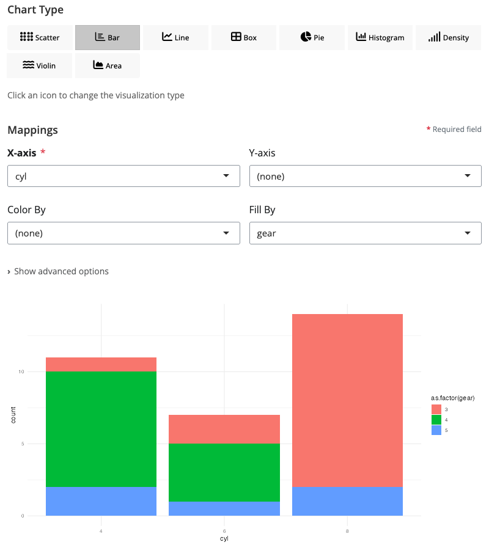
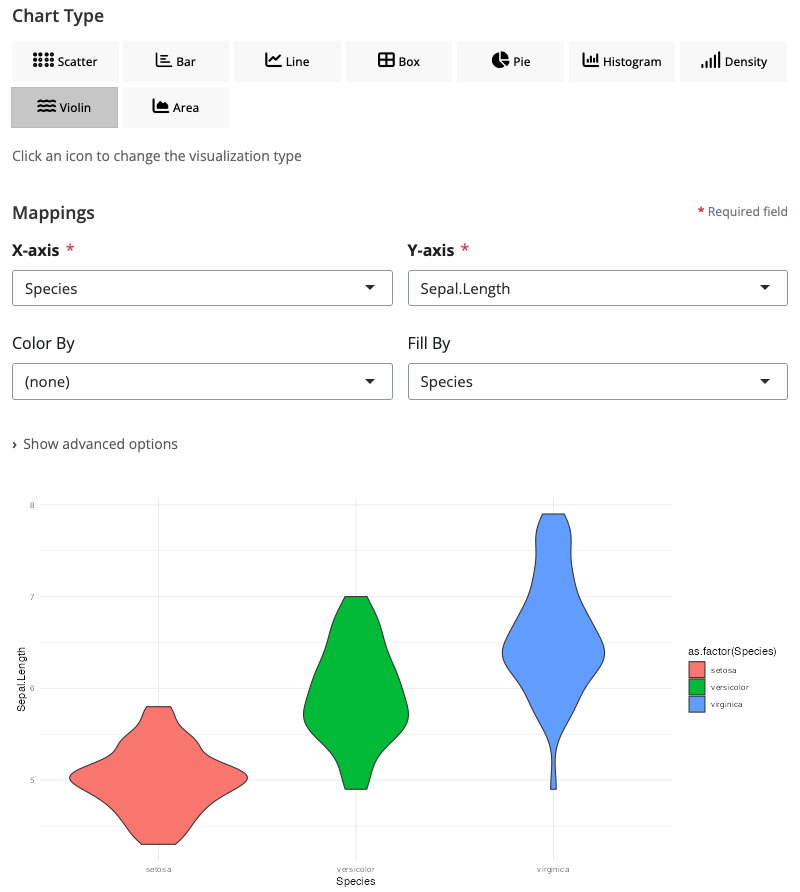
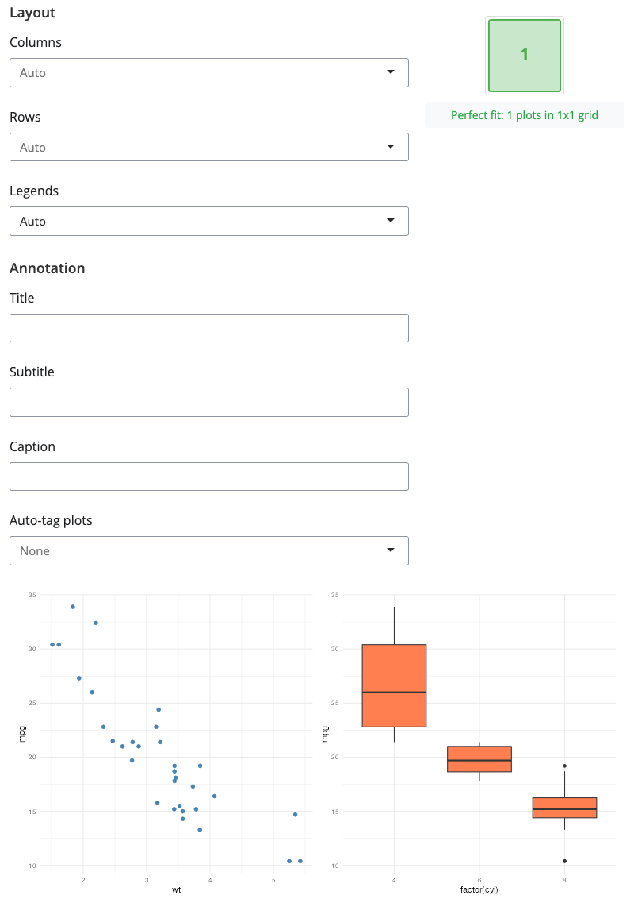
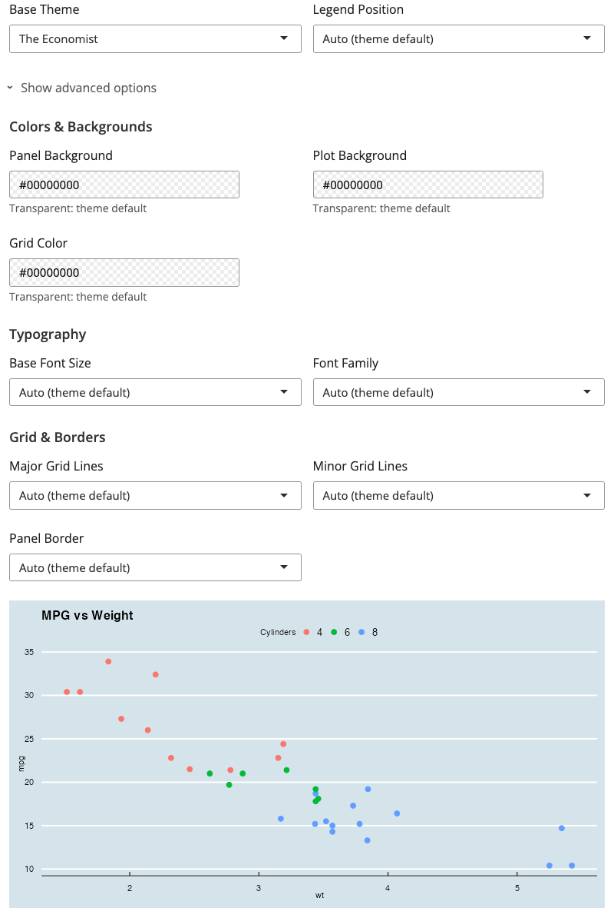

# blockr.ggplot

blockr.ggplot provides interactive blocks for data visualization. Create
scatter plots, bar charts, line charts, and more through visual
interfaces with real-time preview.

## Overview

blockr.ggplot is part of the blockr ecosystem and provides visualization
blocks using ggplot2.

## Installation

``` r
install.packages("blockr.ggplot")
```

Or install the development version from GitHub:

``` r
# install.packages("pak")
pak::pak("BristolMyersSquibb/blockr.ggplot")
```

## Getting Started

Create and launch an empty dashboard:

``` r
library(blockr.ggplot)
serve(new_board())
```

This opens a visual interface in your web browser. Add blocks using the
“+” button, connect them by dragging, and configure each block through
its settings. Visualizations update in real-time as you build your
workflow.

## Available Blocks

blockr.ggplot provides 4 visualization blocks:

### Chart Block

- [ggplot](https://bristolmyerssquibb.github.io/blockr.ggplot/articles/blockr-ggplot-showcase.html#scatter-plot):
  universal chart block supporting 9 chart types
  - [scatter](https://bristolmyerssquibb.github.io/blockr.ggplot/articles/blockr-ggplot-showcase.html#scatter-plot):
    relationships between continuous variables
  - [bar](https://bristolmyerssquibb.github.io/blockr.ggplot/articles/blockr-ggplot-showcase.html#bar-chart):
    compare values across categories
  - [line](https://bristolmyerssquibb.github.io/blockr.ggplot/articles/blockr-ggplot-showcase.html#line-chart):
    trends over time or sequences
  - [boxplot](https://bristolmyerssquibb.github.io/blockr.ggplot/articles/blockr-ggplot-showcase.html#box-plot):
    distribution statistics across groups
  - [violin](https://bristolmyerssquibb.github.io/blockr.ggplot/articles/blockr-ggplot-showcase.html#violin-plot):
    distribution shapes with density
  - [density](https://bristolmyerssquibb.github.io/blockr.ggplot/articles/blockr-ggplot-showcase.html#density-plot):
    smooth probability distributions
  - [area](https://bristolmyerssquibb.github.io/blockr.ggplot/articles/blockr-ggplot-showcase.html#area-chart):
    cumulative magnitude over time
  - [histogram](https://bristolmyerssquibb.github.io/blockr.ggplot/articles/blockr-ggplot-showcase.html#histogram):
    frequency distributions
  - [pie/donut](https://bristolmyerssquibb.github.io/blockr.ggplot/articles/blockr-ggplot-showcase.html#pie-chart):
    proportions of a whole

### Composition Blocks

- [facet](https://bristolmyerssquibb.github.io/blockr.ggplot/articles/blockr-ggplot-showcase.html#facet-wrap-layout):
  split plots into panels by category (wrap or grid layout)
- [grid](https://bristolmyerssquibb.github.io/blockr.ggplot/articles/blockr-ggplot-showcase.html#grid-block):
  combine multiple plots into dashboards
- [theme](https://bristolmyerssquibb.github.io/blockr.ggplot/articles/blockr-ggplot-showcase.html#theme-block):
  apply professional styling with 20+ themes

See
[`vignette("blockr-ggplot-showcase")`](https://bristolmyerssquibb.github.io/blockr.ggplot/articles/blockr-ggplot-showcase.md)
for a complete showcase with screenshots and detailed explanations of
each block.

## Chart Types Gallery

All visualizations are created with the same ggplot block - just by
changing the chart type:

### Distribution Visualizations


*Scatter plot: explore relationships between continuous variables*


*Histogram: visualize distributions of continuous variables*


*Density plot: smooth probability density curves*

### Categorical Comparisons



*Bar chart: compare values across categories*


*Box plot: distribution statistics across groups*



*Violin plot: distribution shapes with density*

### Time Series & Trends


*Line chart: track changes over time*


*Area chart: cumulative totals and magnitude*

### Proportions


*Pie chart: parts of a whole*


*Donut chart: modern pie chart variant*

### Composition Blocks


*Facet block: split into panels by category*



*Grid block: combine multiple plots*



*Theme block: apply professional styling*

## Learn More

The [blockr.ggplot
website](https://bristolmyerssquibb.github.io/blockr.ggplot/) includes
full documentation and the showcase vignette. For information on the
workflow engine, see
[blockr.core](https://bristolmyerssquibb.github.io/blockr.core/).
